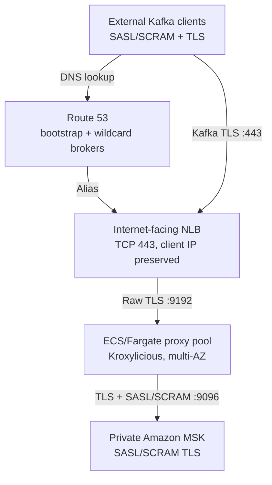
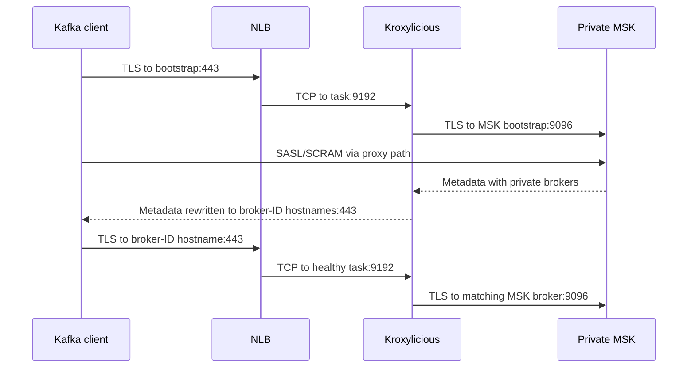

# Architecture

## Selected topology



## Connection flow



The sequence line labelled `C → M` is logical Kafka/SASL traffic transported through NLB and Kroxylicious; there is no direct network connection from the client to MSK.

## Components

| Component | Responsibility |
|---|---|
| Route 53 | Resolves bootstrap and wildcard broker names to the NLB |
| NLB | Public TCP 443 entry point, multi-AZ flow distribution, client-IP preservation |
| ECS/Fargate | Runs at least two independent Kroxylicious processes |
| Kroxylicious | TLS termination, SNI broker selection, Kafka metadata rewriting, private upstream TLS |
| Amazon MSK | Kafka storage, broker leadership, SASL/SCRAM authentication, ACL enforcement |
| Secrets Manager | Stores the downstream wildcard certificate and private key |
| CloudWatch | Logs, ECS/NLB metrics, alarms, and dashboard |

## Listener mapping

| Leg | Publicly visible | Protocol | Port |
|---|---:|---|---:|
| External client → NLB | Yes | Kafka over TLS | 443 |
| NLB → Kroxylicious | No | Same TLS stream | 9192 |
| Kroxylicious management | No | HTTP metrics/health | 9190 |
| Kroxylicious → MSK | No | Kafka SASL/SCRAM over TLS | 9096 |

The NLB target port and MSK port are implementation details within the VPC. Every client-visible endpoint is `443`.

## Addressing model

Kroxylicious listens internally using:

```yaml
sniHostIdentifiesNode:
  bootstrapAddress: bootstrap.kafka.example.com:9192
  advertisedBrokerAddressPattern: broker-$(nodeId).kafka.example.com:443
```

The bootstrap address controls the proxy bind port. The explicit port in the broker pattern controls what Kafka metadata returns to clients.

## High availability

- NLB nodes operate in multiple public subnets.
- ECS places tasks across the supplied private subnets/AZs on a best-effort basis.
- Desired count defaults to two and autoscaling can increase it.
- NLB sends new connections only to healthy targets.
- ECS replaces stopped or unhealthy tasks.
- Kroxylicious instances are independent and keep no shared connection state.

An established TCP flow cannot move between proxy tasks. Kafka clients must retry and rediscover after a task loss. Test client retry settings and recovery time against workload requirements.

## Deployment lifecycle

1. Terraform registers a new ECS task definition.
2. ECS starts new tasks and waits for NLB health checks.
3. ECS drains old targets.
4. Kroxylicious stops accepting new connections and performs bounded graceful draining.
5. Clients whose long-lived connections are closed reconnect through the NLB.

## Alternative private entry points

The proxy and metadata model remain the same if the public NLB is replaced or complemented by:

- An internal NLB reachable over Site-to-Site VPN or Direct Connect.
- An NLB-backed endpoint service for AWS PrivateLink consumers.
- Transit Gateway-connected VPCs.

Those models reduce internet exposure but require client-side private connectivity.
